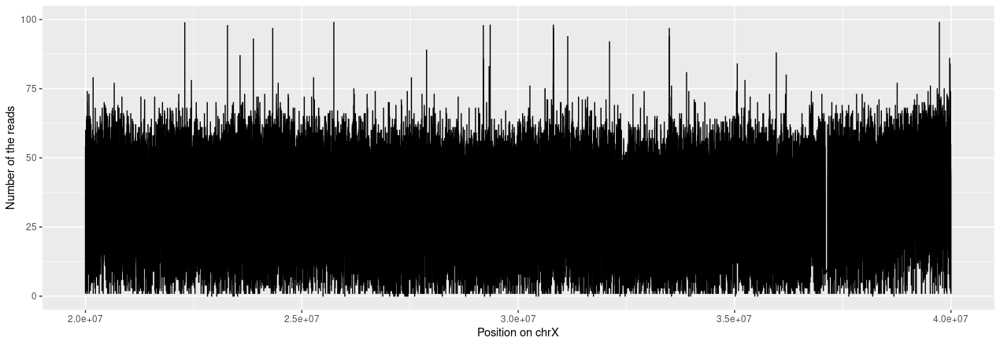

# Cancer Genomics Data Analysis

First, we will, again, prepare virtual environment, where we will work.

### Create environment and get the data

```bash
virtualenv exercise_1
source exercise_1/bin/activate
sudo apt install -y bwa
sudo apt install -y bcftools
sudo apt install -y samtools
sudo apt install -y r-base-core

```

Next, we will get our data. Data labeled as *tu* are reads from the tumor sample. Data labeled as *wt* are reads from the germline sample.

```bash
wget https://gear-genomics.embl.de/data/.exercise/tu.r1.fq.gz
wget https://gear-genomics.embl.de/data/.exercise/tu.r2.fq.gz
wget https://gear-genomics.embl.de/data/.exercise/wt.r1.fq.gz
wget https://gear-genomics.embl.de/data/.exercise/wt.r2.fq.gz
```

### Alignment using bwa-mem
Same as in Exercise_1, we will map the reads to the reference genome. As reference genome, we will use
human genome from [here](https://hgdownload.soe.ucsc.edu/goldenPath/hg19/bigZips/hg19.fa.gz).

We will create separate alignment to reference genome using tumor and germline samples.
Similarly to previous assignment, we will need to first create index file from reference, before we could start with mapping. 

```bash
# get the reference
wget https://hgdownload.soe.ucsc.edu/goldenPath/hg19/bigZips/hg19.fa.gz
# create index files from reference
bwa index hg19.fa.gz

# map the germline sample, using 4 threads for faster computation
bwa mem -t 4 hg19.fa.gz wt.r1.fq.gz wt.r2.fq.gz > alignment_germline.bam

# map the tumor sample, using 4 threads for faster computation
bwa mem -t 4 hg19.fa.gz tu.r1.fq.gz tu.r2.fq.gz > alignment_tumor.bam
```

### Variant calling using delly
Now, we will do variant calling using structural-variant caller delly.
Delly will need .fai index file of the reference genome, so we will generate this first.

Also we will need index files for both alignments - for tumor and germline samples.

```bash
gzip -d hg19.fa.gz
samtools faidx hg19.fa

samtools sort -@ 4 alignment_germline.bam -o alignment_germline_sorted.bam
samtools sort -@ 4 alignment_tumor.bam -o alignment_tumor_sorted.bam
samtools index alignment_tumor_sorted.bam
samtools index alignment_germline_sorted.bam

```

### Generate read-depth plot
Next, we will get read depth of each sample via `samtools depth`.
First, we will downsample the file to the region of the interest.

```
samtools view -b alignment_germline_sorted.bam chrX:20000000-40000000 > germline_sorted.bam
samtools view -b alignment_tumor_sorted.bam chrX:20000000-40000000 > tumor_sorted.bam

samtools depth germline_sorted.bam > germline_depth.txt.gz
samtools depth tumor_sorted.bam > tumor_depth.txt.gz
```
Now we have read-depth data, which will be ploted via R.

```R
library(ggplot2)

x = read.table("tumor_depth.txt.gz")
new_data = x[seq(1,19925851,5), ,] # data needed to be downsampled for R to not fall while plotting
p = ggplot(data=new_data, aes(x=new_data[,2], y=new_data[,3]))
p = p+geom_line()
p = p+xlab("Position on chrX")
p = p+ylab("Number of the reads")
p
ggsave("tumor_depth.png",p)

x = read.table("germline_depth.txt.gz")
new_data = x[seq(1,19925851,5), ,] # data needed to be downsampled for R to not fall while plotting
p = ggplot(data=new_data, aes(x=new_data[,2], y=new_data[,3]))
p = p+geom_line()
p = p+xlab("Position on chrX")
p = p+ylab("Number of the reads")
p
ggsave("germline_depth.png",p)

```
## Obtained results and interpretation
We analyzed reads, that were mapped on the X chromosome on the position 20000000-40000000. We analyzed read depth for reads originating from germline sample and from the tumor sample.

For germline read depth, we obtained plot showing uniform distribution of read depth at the measured position in the genome.

**Plot of the germline read depth:**


For tumor read depth, we obtained plot showing, that approximately first half of the positions have significantly lower read depth, than the later.

The regions with higher overall value of read-depth were presumably covered more times during sequencing, than the other regions, which should point to their higher proportion in the genome.


**Plot of the tumor read depth:**


