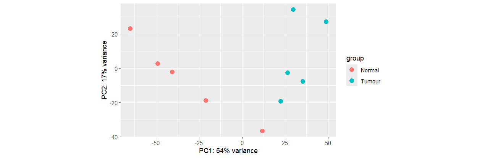
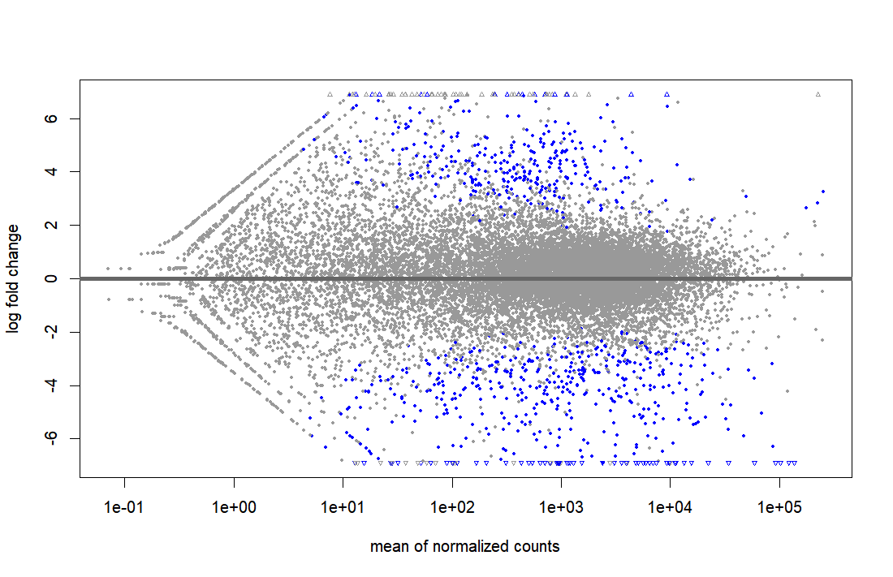
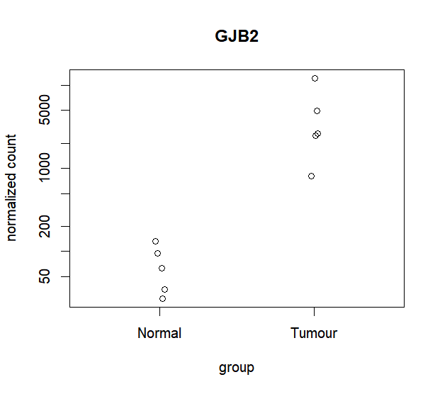
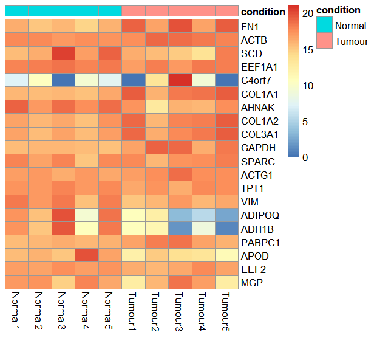

# Working with count matrices 

### Get the data
Firs, we will get the data

```bash
wget https://gear-genomics.embl.de/data/.slides/sample.counts
wget https://gear-genomics.embl.de/data/.slides/sample.info
wget https://gear-genomics.embl.de/data/.slides/template.R

```

### Explore the template
Lets open the template in the Rstudio program.

```R
library(DESeq2)
library(pheatmap)

# Load count matrix
x = read.table("sample.counts", row.names=1, header=T, sep=",")
s = read.table("sample.info", header=T, row.names=1, colClasses=c("character", "factor"))

# Create DESeq2 object
dds = DESeqDataSetFromMatrix(countData = x, colData = s, design = ~ condition)
```

### Differential expression analysis
Run a differential expression analysis (Tumour vs. Normal) using a log-fold change threshold of 1.

```R
dds <- DESeq(dds)
res <- results(dds, lfcThreshold = 1)
res
```

### Generating PCA

```R
vstcounts <- vst(dds, blind=FALSE)
plotPCA(vstcounts, intgroup=c("condition"))
```


PCA shows, that after reducing the data to 2 dimensions, tumor and normal samples are clearly separated on the PCA axes. This could mean, that there there are big enough differences between the normal and tumor samples to distinquish between the two.

### Generating MA-plots
The plot visualizes the differences between measurements taken in two samples, by transforming the data onto M (log ratio) and A (mean average) scales, then plotting these values.

Points will be colored blue if the adjusted p value is less than 0.1. Points which fall out of the window are plotted as open triangles pointing either up or down.
```R
plotMA(res)
```


Next, plot the normalized counts for the GJB2 gene
```R
plotCounts(dds,"GJB2", intgroup = "condition")
```
There we can visualize gene counts for the specified gene and compare the gene counts for normal and tumor sample. It can be shown, that in tumor samples, the GJB2 gene is trancribed much more, than in normal samples, even 100x more.




Finally, we will visualize the differential gene expression results as a heatmap. We will take the top 20 genes according to the adjusted p-value.

```R
ntd <- normTransform(dds)
select <- order(rowMeans(counts(dds,normalized=TRUE)),
                decreasing=TRUE)[1:20]
df <- as.data.frame(colData(dds)[c("condition")])
pheatmap(assay(ntd)[select,], cluster_rows=FALSE, show_rownames=TRUE,
         cluster_cols=FALSE, annotation_col=df)
```




### Exporting into CSV
Export the significant results (padj < 0.01) to a CSV file


```R
resOrdered <- res[order(res$pvalue),]
resSig <- subset(resOrdered, padj < 0.01)
write.csv(as.data.frame(resSig), 
          file="significant_results.csv")
```

